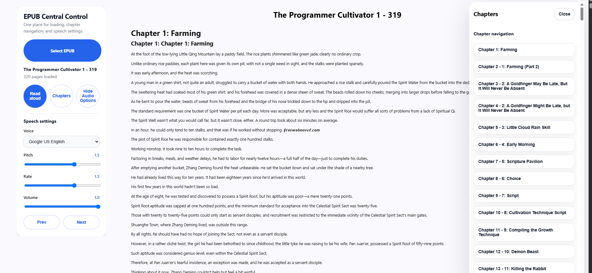

# EpubReader

A browser-based EPUB reading experience built with Angular 21.2.11.

## Project Summary

EpubReader is an Angular web app that loads local EPUB files, renders book pages and images, exposes chapter navigation, and provides read-aloud controls using the browser Web Speech API. The app is designed for fast parsing of EPUB archives in the browser and supports SSR deployment for improved page delivery.

## Preview



Live demo: https://abrahamsanchezdev.github.io/EpubReader/

## What this app does

- Load `.epub` files from the local file picker
- Extract EPUB HTML content, chapters, and image assets in-browser
- Render pages inside a responsive reader layout
- Show chapter navigation and quick jump controls
- Provide audio playback with voice selection, pitch, rate, and volume
- Display load progress during EPUB parsing
- Support Angular SSR for server-side rendering

## How to build & run locally

```bash
npm install
npm start
```

Then open:

```text
http://localhost:4200
```

### Production build

```bash
npm run build
```

### Watch mode

```bash
npm run watch
```

### Run unit tests

```bash
npm test
```

### Lint checks

```bash
npm run lint
```

### Serve SSR build

```bash
npm run serve:ssr:epub-reader
```

Then open:

```text
http://localhost:4000
```

### Deploy to GitHub Pages

```bash
ng build --base-href "https://abrahamsanchezdev.github.io/EpubReader/"
```

Deploy the contents of `dist/epub-reader` to GitHub Pages.

## Application workflow

1. Open the app in the browser.
2. Click **Select EPUB** and choose a `.epub` file.
3. The EPUB loader parses the archive and extracts pages, images, and chapters.
4. Book content renders in the main reader pane.
5. Click **Read aloud** to start or stop speech playback.
6. Open **Audio Options** to select a voice and adjust pitch, rate, and volume.
7. Click **Chapters** to open the navigator and jump to sections quickly.

## Project structure

- `src/app/component/reader` — core EPUB reader UI and controls
- `src/app/component/epub/epub-display` — rendering book pages and image replacement
- `src/app/component/epub/text-to-speech` — speech playback component
- `src/app/service/epub` — EPUB parsing, index extraction, and content loading
- `src/app/service/text-to-speech` — browser speech synthesis management
- `src/app/service/zip` — ZIP archive extraction for EPUB containers
- `src/app/service/save-to-local-storage` — local cache support for loaded EPUB state

## Architecture highlights

- Event-driven Angular application with service-based communication
- Reactive state managed using Angular signals and computed values
- Browser-native EPUB parsing with JSZip and DOM sanitization
- Audio controls implemented through the Web Speech API

## Technology stack

- **Angular 21** — application framework and standalone components
- **TypeScript** — typed application logic and service orchestration
- **JSZip** — EPUB archive extraction from `.epub` files
- **Web Speech API** — read aloud playback with voice and audio controls
- **Angular SSR** — server-side rendering support for deployment

## Code quality and engineering practices

- Clean separation of concerns: reader UI, EPUB parsing, and speech services
- Modular service design for reusable EPUB and audio logic
- Reactive UI state with signals for better maintainability
- Build scripts and linting for consistent development workflow

## Development insights

The project focuses on delivering a polished EPUB reader experience without backend file upload requirements. It combines archive parsing, dynamic chapter rendering, and audio playback in a single browser application.

## Learning outcomes

- Implemented browser-based EPUB parsing and content rendering
- Integrated speech synthesis with adjustable voice parameters
- Built a responsive Angular reader UI with chapter navigation
- Prepared the app for SSR deployment and GitHub Pages hosting

## Contact

Demo: https://abrahamsanchezdev.github.io/EpubReader/
Repo: https://github.com/abrahamsanchezdev/EpubReader

---

# EpubReader (Versión en Español)

Una experiencia de lectura EPUB en el navegador construida con Angular 21.2.11.

## Resumen del proyecto

EpubReader es una aplicación web Angular que carga archivos EPUB locales, renderiza páginas e imágenes del libro, muestra navegación por capítulos y ofrece controles de lectura en voz alta usando la API Web Speech del navegador. La aplicación está diseñada para un análisis rápido de archivos EPUB en el navegador y admite despliegue SSR para mejorar la entrega de la página.

## Vista previa


Demo en vivo: https://abrahamsanchezdev.github.io/EpubReader/

## Qué hace esta aplicación

- Cargar archivos `.epub` desde el selector local
- Extraer contenido HTML, capítulos y recursos de imagen del EPUB en el navegador
- Renderizar páginas dentro de un diseño de lector responsivo
- Mostrar navegación de capítulos y controles de salto rápido
- Proporcionar reproducción de audio con selección de voz, tono, velocidad y volumen
- Mostrar progreso de carga durante el análisis del EPUB
- Soportar Angular SSR para renderizado del lado del servidor

## Cómo construir y ejecutar localmente

```bash
npm install
npm start
```

Luego abre:

```text
http://localhost:4200
```

### Build de producción

```bash
npm run build
```

### Modo watch

```bash
npm run watch
```

### Ejecutar pruebas unitarias

```bash
npm test
```

### Revisar lint

```bash
npm run lint
```

### Servir build SSR

```bash
npm run serve:ssr:epub-reader
```

Luego abre:

```text
http://localhost:4000
```

### Despliegue en GitHub Pages

```bash
ng build --base-href "https://abrahamsanchezdev.github.io/EpubReader/"
```

Despliega el contenido de `dist/epub-reader` en GitHub Pages.

## Flujo de la aplicación

1. Abre la aplicación en el navegador.
2. Haz clic en **Select EPUB** y elige un archivo `.epub`.
3. El cargador EPUB analiza el archivo y extrae páginas, imágenes y capítulos.
4. El contenido del libro se renderiza en el panel principal.
5. Haz clic en **Read aloud** para iniciar o detener la reproducción de voz.
6. Abre **Audio Options** para seleccionar voz y ajustar tono, velocidad y volumen.
7. Haz clic en **Chapters** para abrir el navegador y saltar rápidamente a secciones.

## Estructura del proyecto

- `src/app/component/reader` — interfaz principal del lector EPUB y controles
- `src/app/component/epub/epub-display` — renderizado de páginas y reemplazo de imágenes
- `src/app/component/epub/text-to-speech` — componente de reproducción de voz
- `src/app/service/epub` — análisis EPUB, extracción de índice y carga de contenido
- `src/app/service/text-to-speech` — gestión de síntesis de voz del navegador
- `src/app/service/zip` — extracción de archivos ZIP para contenedores EPUB
- `src/app/service/save-to-local-storage` — soporte de caché local para el estado EPUB cargado

## Aspectos de arquitectura

- Aplicación Angular basada en eventos con comunicación mediante servicios
- Estado reactivo gestionado con señales y valores computados de Angular
- Análisis EPUB nativo en el navegador con JSZip y sanitización DOM
- Controles de audio implementados con la API Web Speech

## Stack tecnológico

- **Angular 21** — framework de aplicación y componentes standalone
- **TypeScript** — lógica de aplicación tipada y orquestación de servicios
- **JSZip** — extracción de archivos EPUB desde `.epub`
- **Web Speech API** — reproducción de lectura en voz alta con controles de audio
- **Angular SSR** — soporte de renderizado del lado del servidor para despliegue

## Calidad de código y prácticas de ingeniería

- Separación clara de responsabilidades: UI de lector, análisis EPUB y servicios de voz
- Diseño modular de servicios para lógica reutilizable de EPUB y audio
- Estado de UI reactivo con señales para mejor mantenibilidad
- Scripts de compilación y linting para flujo de desarrollo consistente

## Insights de desarrollo

El proyecto se enfoca en entregar una experiencia de lectura EPUB pulida sin requerir backend para subir archivos. Combina análisis de archivos, renderizado dinámico de capítulos y reproducción de audio en una sola aplicación de navegador.

## Resultados de aprendizaje

- Implementé análisis EPUB en el navegador y renderizado de contenido
- Integré síntesis de voz con parámetros ajustables
- Construí una UI responsiva de lector Angular con navegación por capítulos
- Preparé la aplicación para despliegue SSR y GitHub Pages

## Contacto

Demo: https://abrahamsanchezdev.github.io/EpubReader/
Repositorio: https://github.com/abrahamsanchezdev/EpubReader
